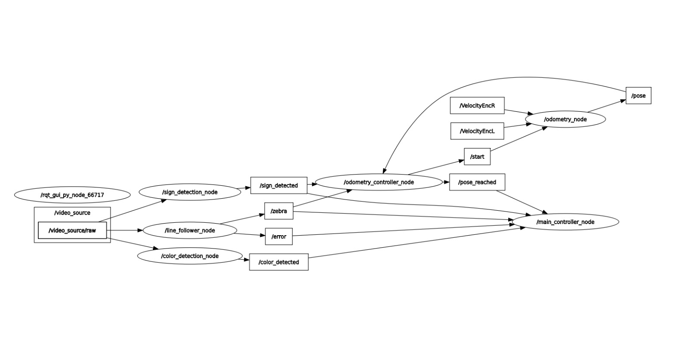

# Robot Movil Autónomo (Puzzlebot) - Proyecto Final ROS2

Este proyecto implementa un robot móvil autónomo basado en un Puzzlebot utilizando ROS2 Humble. El objetivo es recorrer un entorno a escala que incluye rectas, curvas, cruces y obstáculos, tomando decisiones de navegación de manera completamente autónoma.

## Funcionalidad

- Seguimiento de línea
- Evitación de obstáculos
- Detección de semáforos y señales viales
- Comportamiento adaptativo ante señales
- Registro de detecciones en pantalla

## Comportamientos esperados según señal detectada

| Señal             | Acción                                      |
|-------------------|---------------------------------------------|
| Work in progress  | Reducir velocidad al 50% por 10 segundos    |
| Give Way          | Reducir velocidad al 50% por 5 segundos     |
| Stop              | Detenerse completamente por 10 segundos     |
| Flechas azules    | Continuar recto o girar en la dirección dada|

## Ramas del Proyecto

- `vision-computacional`: Detección de semáforos y señales usando visión por computadora.
- `control`: Implementación de seguimiento de línea y control basado en odometría.

## Diagrama de flujo

## Demostración
Video con el funcionamiento del robot autónomo durante la entrega final del proyectoo

## Autores

Daniel De Regules Gamboa

Fiona Stasi Fernandez

Alejandro Araiza Escamilla

Paul Park
